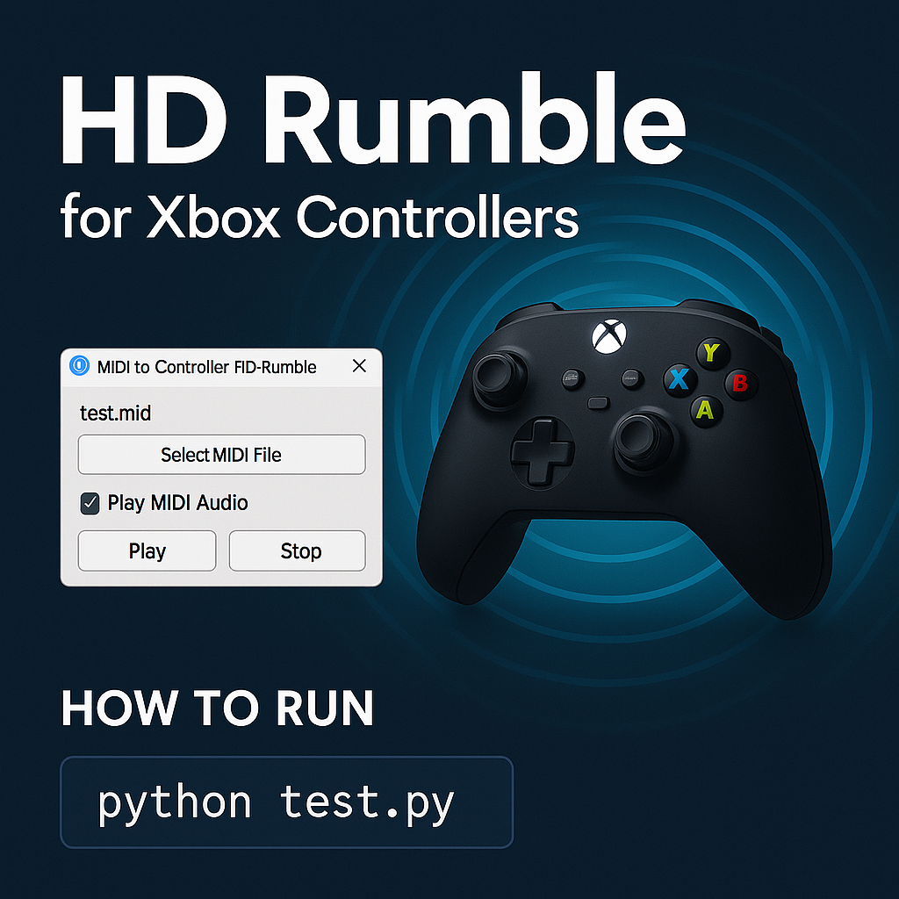

# HD Rumble for Xbox Controllers


> Simulate rich, dynamic vibration feedback (HD Rumble-style) on Xbox controllers by mapping MIDI note data to vibration patterns.

---

## 🎮 Project Overview

This tool lets you play MIDI files and feel them via **Xbox controller vibrations** using various programmable rumble patterns. It supports audio playback (optional) and includes a GUI for ease of use.

- 🎼 Converts MIDI notes to vibration events
- 🧠 Multiple tactile patterns like `fade`, `pulse`, `sine`, and `burst`
- 🎛️ Left/Right motor mapping based on note pitch or instrument
- 🎵 Optional MIDI audio playback for immersive experience
- 🖥️ Simple and elegant Tkinter GUI

---

## 🖥️ GUI Preview

- Select a `.mid` file  
- Check/uncheck "Play MIDI Audio"  
- Click **Play** to start vibration  
- Click **Stop** to end the playback  

---

## 🧰 Features

- Play MIDI files and feel note-driven vibration
- Custom vibration patterns: `pulse`, `fade`, `sine`, `burst`, `step`, and more
- Left/Right motor mapping for musical instrument zones
- Audio playback option via `pygame` (for syncing vibration with sound)
- Intuitive Tkinter GUI

---

## 📦 Requirements

Install dependencies listed in `req.txt`:

```bash
pip install -r req.txt
